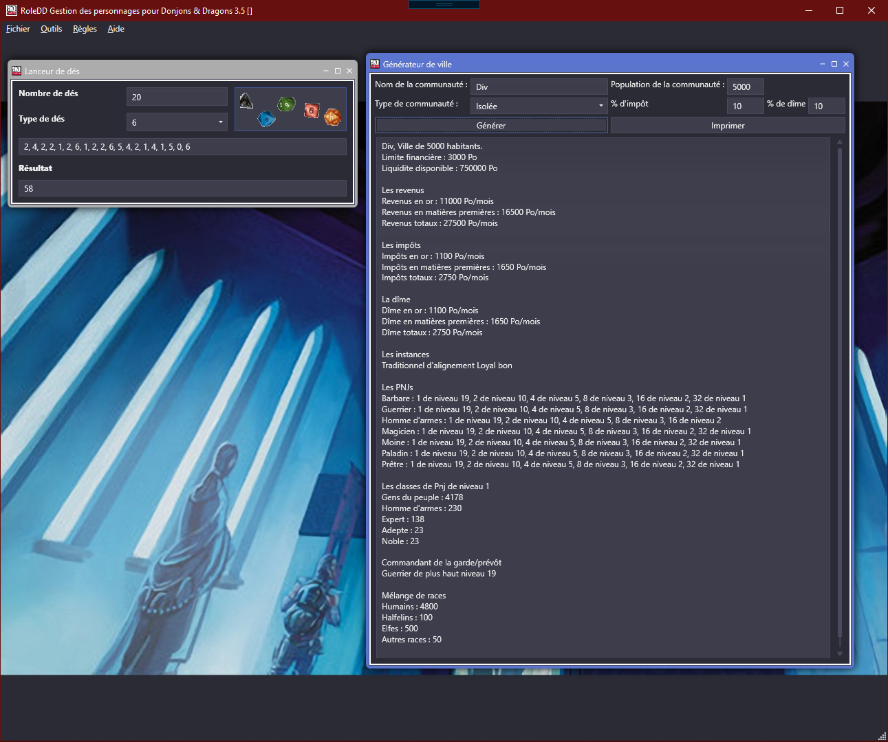

# RoleDDNG

RoleDD for a new generation of players and creators (unnoficial version)

Uses C# 8 (with Nullable Reference Types enabled), XAML (WPF), .NET Core 3.1, MVVMLight (.NET Standard variant), PetaPoco with OleDb, and AdonisUI

The source code is licensed under the GNU General Public License version 3 (GPLv3)

## State

! NOT DONE !
